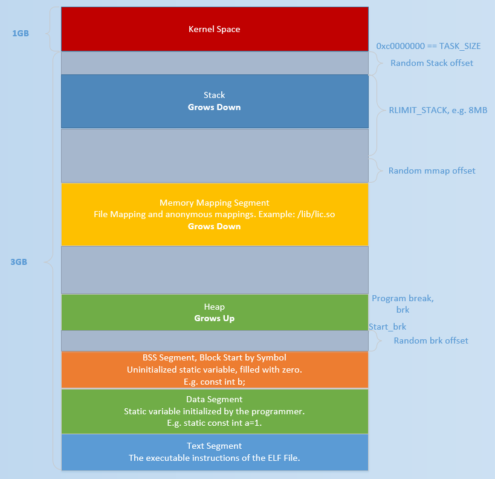

# [Heap Overview](https://ctf-wiki.github.io/ctf-wiki/pwn/linux/glibc-heap/heap_overview-zh/)

目前 Linux 标准发行版中使用的堆分配器是 glibc 中的堆分配器：ptmalloc2。ptmalloc2 主要是通过 malloc/free 函数来分配和释放内存块。

需要注意的是，在内存分配与使用的过程中，Linux 有这样的一个基本内存管理思想，**只有当真正访问一个地址的时候，系统才会建立虚拟页面与物理页面的映射关系**。

## 基本操作

### malloc

- 当 n=0 时，返回当前系统允许的堆的最小内存块。
- 当 n 为负数时，由于在大多数系统上，**size_t 是无符号数（这一点非常重要）**，所以程序就会申请很大的内存空间，但通常来说都会失败，因为系统没有那么多的内存可以分配。

### free

- **当 p 为空指针时，函数不执行任何操作。**
- 当 p 已经被释放之后，再次释放会出现乱七八糟的效果，这其实就是 `double free`。
- 除了被禁用 (mallopt) 的情况下，当释放很大的内存空间时，程序会将这些内存空间还给系统，以便于减小程序所使用的内存空间。

## 背后的系统调用

这些函数背后的系统调用主要是 [(s)brk](http://man7.org/linux/man-pages/man2/sbrk.2.html) 函数以及 [mmap, munmap](http://man7.org/linux/man-pages/man2/mmap.2.html) 函数。

初始时，堆的起始地址 [start_brk](http://elixir.free-electrons.com/linux/v3.8/source/include/linux/mm_types.h#L365) 以及堆的当前末尾 [brk](http://elixir.free-electrons.com/linux/v3.8/source/include/linux/mm_types.h#L365) 指向同一地址。根据是否开启 ASLR，两者的具体位置会有所不同

- 不开启 ASLR 保护时，start_brk 以及 brk 会指向 data/bss 段的结尾。
- 开启 ASLR 保护时，start_brk 以及 brk 也会指向同一位置，只是这个位置是在 data/bss 段结尾后的随机偏移处。

具体效果如下图

